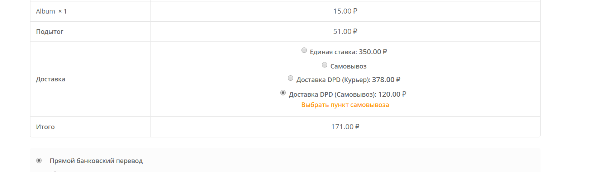
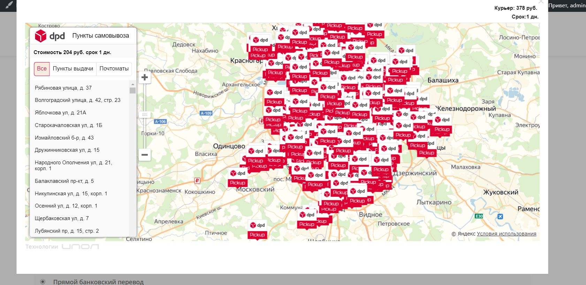
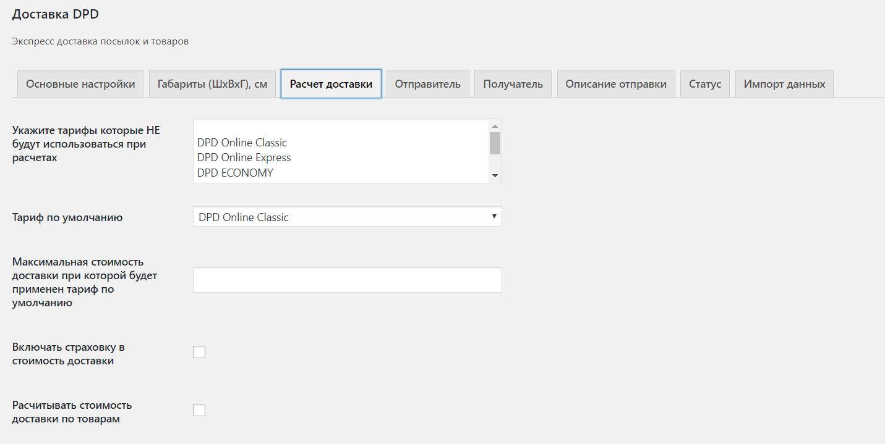
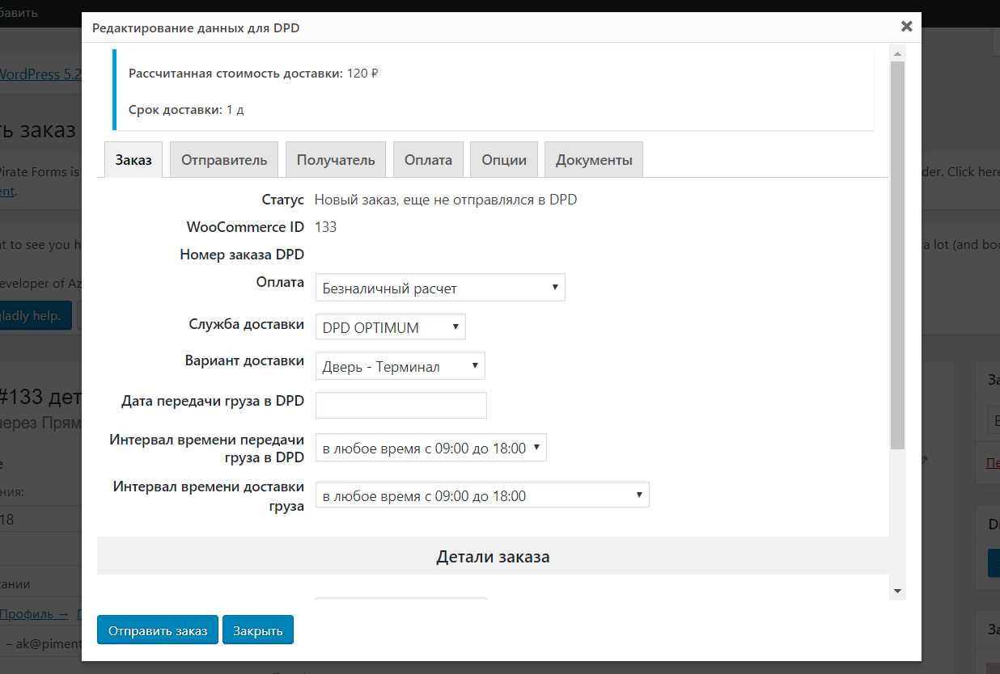

# Официальный модуль DPD для WordPress WooCommerce.

Установите модуль DPD и оформляйте заказы одной кнопкой прямо из админ панели wordpress.

*DPD*
*ДОСТАВЛЯЕМ ПОСЫЛКИ ТЕХ, КТО ДЕЛАЕТ БИЗНЕС. ВЫГОДНО, НАДЕЖНО, УДОБНО!*

Для отправки посылок через модуль заключите [договор](https://new.dpd.ru/agreement?new-site=Y&utm_source=bitrix&utm_campaign=bitrix) с DPD и получите скидку 20% на 2 месяца для новых клиентов

### Преимущества:
*	Отправляйте посылки в день установки модуля
*	Непрерывный клиентский путь на вашем сайте: от выбора товара до оформления доставки
*	Оперативная поддержка от DPD

### Возможности для пользователя CMS: 
*	Создание заказов на доставку и вызов курьера DPD прямо из админ панели WordPress
*	Отслеживание статуса посылок в WordPress
*	Добавление нескольких складов отгрузки
*	Настройка скидки / наценки для каждого варианта доставки
*	Печать квитанций к заказам и актов передачи курьеру из админ панели WordPress
*	Создание, редактирование и отмена заказов 
*	Выбор транспортного средства (например, для теплого груза)
*	Поддержка мульти-аккаунтов для работы со странами СНГ

### Возможности для покупателя на сайте:
*	Предоставление всех возможных способов доставки
*	Автоматический расчет стоимости доставки
*	Отображение вариантов доставки в зависимости от веса товара
*	Вывод на страницу оформления заказа даты и стоимости доставки в зависимости от габаритов заказа
*	Интерактивная карта пунктов выдачи заказа 

## Установка

1. Скачайте и распакуйте [архив](https://bitbucket.org/DPDinRussia/dpd.wordpress/get/master.zip) с модулем.
1. Его содержимое скопируйте в директорию /wp-content/plugins/woo-dpd/ Вашего сайта
1. Активируйте плагин на странице "Плагины" WordPress
1. Перейдите на страницу "WooCommerce / Настройки / Доставка / Доставка DPD" и произведите настройку плагина
1. После ввода данных авторизации выполните синхронизацию данных

### Обновление данных

Для поддержания в актуальном состоянии данных о городах обслуживания и списка ПВЗ DPD
модулю необходимо обновлять свои данные. Для этого необходимо настроить запуск 
скрипта data-update.php с периодом раз в сутки.

Примерное задания для крона с запуском в 12ч ночи будет выглядеть следующим образом
`0 0 * * * wget -O /dev/null http://ваш-сайт.ru/?action=dataUpdate`  

Внимание! Запускать данное задание желательно во время наименьшей нагрузки на сайт, например
ночью.

### Обновление статусов

Для работы механизма обновления и синхронизации статусов заказа необходимо настроить запуск
скрипта status-update.php с периодом раз в 10 минут 

Примерное задание для крона будет выглядеть следующим образом
`*/10 * * * * wget -O /dev/null http://ваш-сайт.ru/?action=statusUpdate`

## Часто задаваемые вопросы

### Не сохраняются настройки модуля

Проверьте заполнение всех обязательных полей на странице.
В случае если какое-то поле пропущено - в верхней части страницы будет отображена ошибка

### Не удается выбрать город отправителя

Запустите импорт данных заново. 
В случае если включен тестовый режим - отключите его и выполните синхронизацию заново.

### Не удается выбрать терминал

Запустите импорт данных заново. 
В случае если включен тестовый режим - отключите его и выполните синхронизацию заново.

### Не отображается доставка

Проверьте заполнен ли город отправителя. 

В случае если доставка выполняется от терминала, проверьте есть ли подходящий терминал в Вашем
городе отправления, в противном случае выберите доставку от двери

### Не соответствует стоимость доставки расчитанной на сайте DPD

Убедитесь, что на сайте DPD Вы выполняете расчет доставки по тем же параметрам, что и модуль.
На стоимоть доставки влияют такие параметры как

1. Габариты посылки (ширина, высота, длина)
1. Вес посылки
1. Объявленная ценность
1. Вид доставки (от терминала/двери до терминала/двери)

### Ничего не помогает

В случае проблем с модулем обратитесь по адресу support@ipol.ru, описав суть проблемы и 
указав клиентский номер в системе DPD.

## Документация
Полная документация по модулю доступна [здесь](https://ipol.ru/spravka/dpd_wp/about_plugin/)

## Скриншоты

1. 
1. 
1. 
1. 